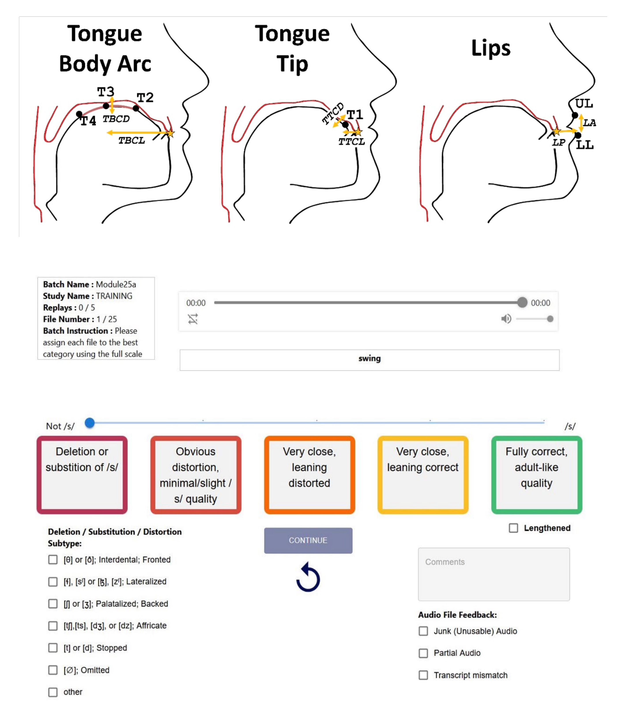

<p style="text-align:center;">

</p>

## Abstract
<div style="text-align: justify"> This study evaluated whether articulatory kinematics, inferred by Articulatory Phonology speech inversion neural networks, aligned with perceptual ratings of /r/ and /s/ in the speech of children with speech sound disorders. Articulatory Phonology vocal tract variables were inferred for 5,961 utterances from 118 children and 3 adults, aged 2.25-45 years. Perceptual ratings were standardized using the novel 5-point PERCEPT Rating Scale and training protocol. Two research questions examined if the articulatory patterns of inferred vocal tract variables aligned with the perceptual error category for the phones investigated (e.g., tongue tip is more anterior in dentalized /s/ productions than in correct /s/). A third research question examined if gradient PERCEPT Rating Scale scores predicted articulatory proximity to correct productions. Estimated marginal means from linear mixed models supported 17 of 18 /r/ hypotheses, involving tongue tip and tongue body constrictions. For /s/, estimated marginal means from a second linear mixed model supported 7 of 15 hypotheses, particularly those related to the tongue tip. A third linear mixed model revealed that PERCEPT Rating Scale scores significantly predicted articulatory proximity of errored phones to correct productions. Inferred vocal tract variables differentiated category and magnitude of articulatory errors for /r/, and to a lesser extent for /s/, aligning with perceptual judgments. These findings support the clinical interpretability of speech inversion vocal tract variables and the PERCEPT Rating Scale in quantifying articulatory proximity to the target sound, particularly for /r/. </div>
<br>

| Paper                                                                                      |
|--------------------------------------------------------------------------------------------|
| [**PerceptualRatings**](https://arxiv.org/pdf/2507.01888) |

<br>

Please cite our work if you found it useful,

```
@article{benway2025perceptual,
  title={Perceptual Ratings Predict Speech Inversion Articulatory Kinematics in Childhood Speech Sound Disorders},
  author={Benway, Nina R and Tabatabaee, Saba and Wang, Dongliang and Munson, Benjamin and Preston, Jonathan L and Espy-Wilson, Carol},
  journal={arXiv preprint arXiv:2507.01888},
  year={2025}
}
```
