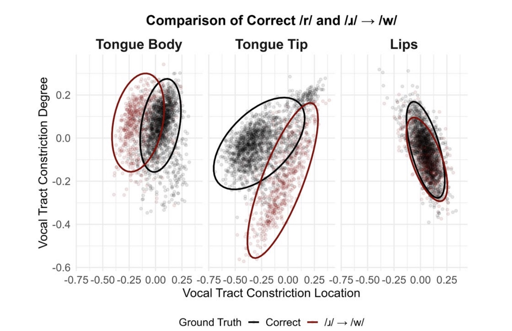

<p style="text-align:center;">

</p>

## Abstract
<div style="text-align: justify"> Speech inversion holds much potential to describe speech errors in childhood speech sound disorders. However, the clinical interpretability of speech inversion tract variables is unknown. This study is the first to show, through linear mixed modeling,
that acoustic-to-articulatory speech inversion can quantify statistically significant articulatory differences between several
perceptually salient subtypes of /ɹ/ and /s/ speech sound errors, and correct /ɹ/ and /s/ targets, in American English..</div>
<br>

| Paper                                                                                      |
|--------------------------------------------------------------------------------------------|
| [**Subtyping Speech Errors in Children**](https://www.isca-archive.org/interspeech_2025/benway25_interspeech.pdf) |

<br>

Please cite our work if you found it useful,

```
@inproceedings{benway2025subtyping,
  title={Subtyping Speech Errors in Childhood Speech Sound Disorders with Acoustic-to-Articulatory Speech Inversion},
  author={Benway, Nina R and Tabatabaee, Saba and Munson, Benjamin and Preston, Jonathan and Espy-Wilson, Carol},
  booktitle={Proc. Interspeech 2025},
  pages={2800--2804},
  year={2025}
}
```
