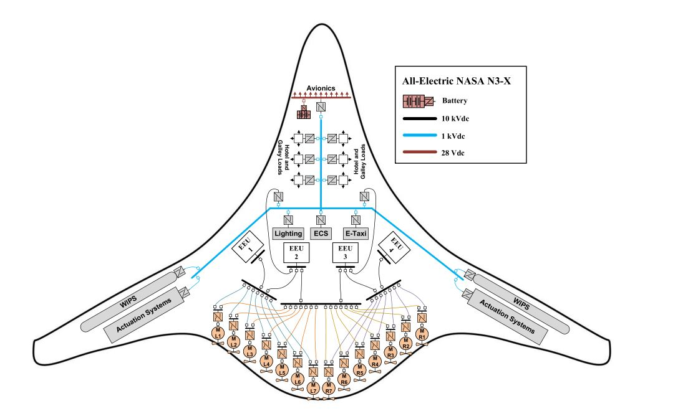

<p style="text-align:center;">

</p>

## Abstract
<div style="text-align: justify"> In this article, turboelectric NASA N3-X aircraft is fully electrified for the first time; engines are removed and the all-electric NASA N3-X aircraft electric power system (EPS) is introduced, supplied by four electrochemical energy units (EEUs), including batteries, fuel cells, and supercapacitors. In this regard, three medium-voltage direct current (MVdc), ±5 kVdc, bipolar EPS architectures are proposed for the aircraft and discussed and analyzed in detail by a performing power flow (PF) analysis. The proposed architectures are also considered as three-phase ac, 10 kVac, EPSs and discussed and analyzed in detail for comparison. To perform the PF analysis for the proposed MVdc EPSs, two PF solvers for dc networks under constant power generations and loads are also modified and developed. Potential cable conductors are selected and hints are provided to choose final conductors; to assess the performance of selected conductors, dimensions of the aircraft are estimated and cable parameters are calculated based on the presented dimensions. The proposed EPS architectures meet power system planning criteria under normal condition as well as all n −1 contingencies. This article aims to assess newly designed EPSs and, therefore, assumptions are made about EEUs and propulsion motors to the extent whereby PF analysis is affected.</div>
<br>

| Paper                                         
|---------------------------------------------------------------------------------------------------------|
| [**All-Electric NASA N3-X Aircraft**](https://ieeexplore.ieee.org/abstract/document/9730878) |

<br>

Please cite our work if you found it useful,

```
@ARTICLE{9730878,
  author={Ghassemi, Mona and Barzkar, Ashkan and Saghafi, Mohammadreza},
  journal={IEEE Transactions on Transportation Electrification}, 
  title={All-Electric NASA N3-X Aircraft Electric Power Systems}, 
  year={2022},
  volume={8},
  number={4},
  pages={4091-4104},
  keywords={Aircraft;Aircraft propulsion;NASA;Voltage control;Transportation;Conductors;Power cables;All-electric aircraft (AEA);electric power system (EPS);medium-voltage direct current (MVdc);power flow (PF) analysis;switchgear architectures},
  doi={10.1109/TTE.2022.3158186}}
```
