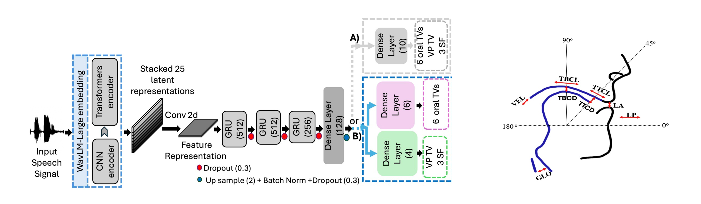

<p style="text-align:center;">

</p>

## Abstract
<div style="text-align: justify"> Speech is produced through the coordination of vocal tract
constricting organs: lips, tongue, velum, and glottis. Previous works developed Speech Inversion (SI) systems to recover
acoustic-to-articulatory mappings for lip and tongue constrictions, called oral tract variables (TVs), which were later enhanced by including source information (periodic and aperiodic energies, and F0 frequency) as proxies for glottal control.
Comparison of the nasometric measures with high-speed nasopharyngoscopy showed that nasalance can serve as ground
truth, and that an SI system trained with it reliably recovers velum movement patterns for American English speakers.
Here, two SI training approaches are compared: baseline models that estimate oral TVs and nasalance independently, and a
synergistic model that combines oral TVs and source features
with nasalance. The synergistic model shows relative improvements of 5% in oral TVs estimation and 9% in nasalance estimation compared to the baseline models.</div>
<br>

| Paper                                         
|---------------------------------------------------------------------------------------------------------|
| [**Speech Inversion by Incorporating Nasality**](https://arxiv.org/pdf/2506.09231) |

<br>

Please cite our work if you found it useful,

```
@inproceedings{tabatabaee25b_interspeech,
  title     = {{Enhancing Acoustic-to-Articulatory Speech Inversion by Incorporating Nasality}},
  author    = {Saba Tabatabaee and Suzanne Boyce and Liran Oren and Mark Tiede and Carol Espy-Wilson},
  year      = {2025},
  booktitle = {{Interspeech 2025}},
  pages     = {325--329},
  doi       = {10.21437/Interspeech.2025-2387},
  issn      = {2958-1796},
}
```
