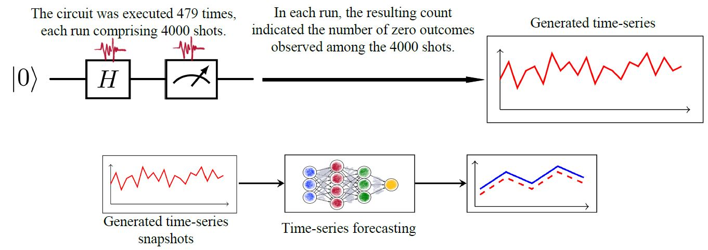

<p style="text-align:center;">

</p>

## Abstract
<div style="text-align: justify"> Creating Speaker Verification (SV) systems for classroom settings that are robust to classroom noises such as babble noise is crucial for the development of AI tools that assist educational
environments. In this work, we study the efficacy of finetuning with augmented children datasets to adapt the x-vector and ECAPA-TDNN to classroom environments. We demonstrate that finetuning with augmented children’s datasets is powerful in that regard and reduces the Equal Error Rate (EER) of xvector and ECAPA-TDNN models for both classroom datasets and children speech datasets. Notably, this method reduces EER of the ECAPA-TDNN model on average by half (a 5% improvement) for classrooms in the MPT dataset compared to the ECAPA-TDNN baseline model. The x-vector model shows an 8% average improvement for classrooms in the NCTE dataset compared to its baseline.</div>
<br>

| Paper                                         
|---------------------------------------------------------------------------------------------------------|
| [**FT-Boosted**](https://www.isca-archive.org/interspeech_2025/tabatabaee25_interspeech.pdf) |

<br>

Please cite our work if you found it useful,

```
@inproceedings{tabatabaee25_interspeech,
  title     = {{FT-Boosted SV: Towards Noise Robust Speaker Verification for English Speaking Classroom Environments }},
  author    = {Saba Tabatabaee and Jing Liu and Carol Espy-Wilson},
  year      = {2025},
  booktitle = {{Interspeech 2025}},
  pages     = {2815--2819},
  doi       = {10.21437/Interspeech.2025-1002},
  issn      = {2958-1796},
}
```
