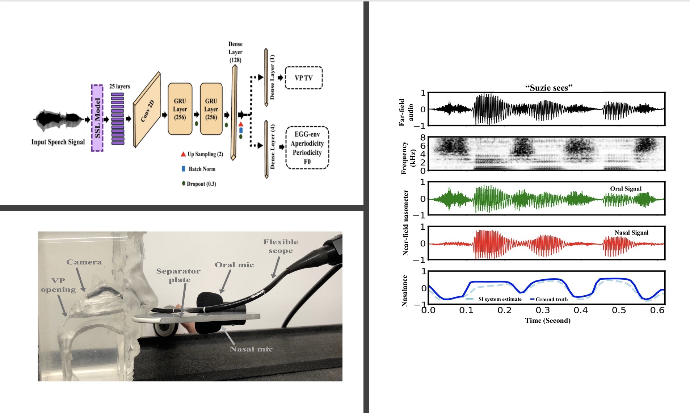

<p style="text-align:center;">

</p>

## Abstract
<div style="text-align: justify"> Traditional clinical approaches for assessing nasality, such as nasopharyngoscopy and nasometry, involve unpleasant experiences and are problematic for children. Speech
Inversion (SI), a noninvasive technique, offers a promising alternative for estimating articulatory movement without the need
for physical instrumentation. In this study, an SI system trained
on nasalance data from healthy adults is augmented with source
information from electroglottography and acoustically derived
F0, periodic and aperiodic energy estimates as proxies for glottal
control. This model achieves 16.92% relative improvement in
Pearson Product-Moment Correlation (PPMC) compared to a
previous SI system for nasalance estimation. To adapt the SI
system for nasalance estimation in children with Velopharyngeal
Insufficiency (VPI), the model initially trained on adult speech
was fine-tuned using children with VPI data, yielding an 7.90%
relative improvement in PPMC compared to its performance
before fine-tuning.</div>
<br>

| Paper                                         
|---------------------------------------------------------------------------------------------------------|
| [**Speech Inversion**](https://arxiv.org/pdf/2509.09489) |

<br>

Please cite our work if you found it useful,

```
@article{tabatabaee2025acoustic,
  title={Acoustic to Articulatory Speech Inversion for Children with Velopharyngeal Insufficiency},
  author={Tabatabaee, Saba and Boyce, Suzanne and Oren, Liran and Tiede, Mark and Espy-Wilson, Carol},
  journal={arXiv preprint arXiv:2509.09489},
  year={2025}
}
```
